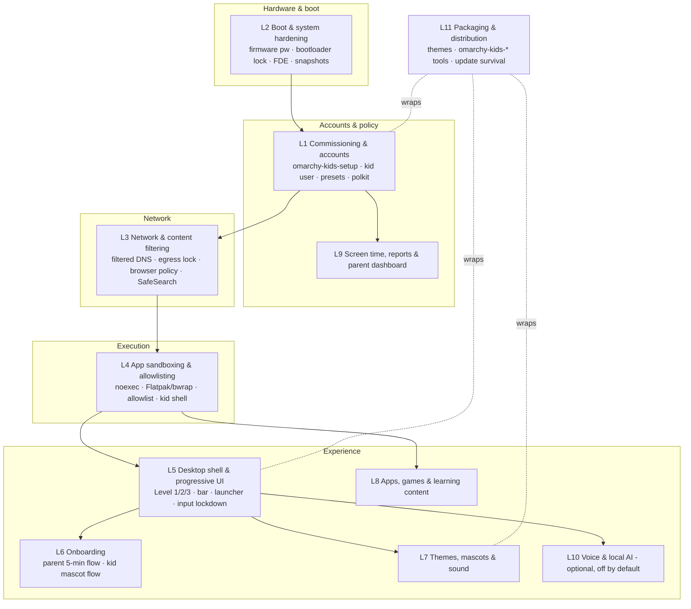

# Architecture Overview: the layer model

_status: draft · updated 2026-09-01 — layer boundaries are a proposal; each layer doc lists what is verified
vs. assumed. Change them by RFC._

Kids Mode is not one program. It is a stack of eleven layers, each of which can be researched, owned, built
and shipped somewhat independently — that is how a community with no free time gets anything done. The
layer index (L1–L11) is used in issue templates, labels, docs and the backlog.

## The layers

| # | Layer | Owns | The one question it must answer | Doc |
| --- | --- | --- | --- | --- |
| L1 | **Commissioning & accounts** | The parent-run setup tool; creation of the kid account(s); age presets; polkit/sudo policy; parent password/PIN recovery | *Separate Unix user, or a mode inside the parent's session?* | [01](layers/01-commissioning-and-accounts.md) |
| L2 | **Boot & system hardening** | Firmware password guidance; bootloader lock-down; disk encryption; snapshot/rollback interplay; VT/TTY lock-down | *Can a kid get root from the boot menu or a TTY?* | [02](layers/02-boot-and-system-hardening.md) |
| L3 | **Network & content filtering** | Filtered DNS (provider or local); DNS/DoH egress lock; browser enterprise policies; SafeSearch/YouTube-restricted enforcement; "pause for 15 min" | *What's the boring, robust default that stops the pop-up?* | [03](layers/03-network-and-content-filtering.md) |
| L4 | **App sandboxing & allowlisting** | What the kid can run and how it's contained: `noexec` home, Flatpak/bubblewrap profiles, launcher allowlist, restricted kid shell | *How do we allow GCompris but not `curl \| sh`?* | [04](layers/04-app-sandboxing-and-allowlisting.md) |
| L5 | **Desktop shell & progressive UI** | The kid's Hyprland config; Level 1/2/3 behaviour; bar; launcher; keybinding sets; disabled inputs; crash/exit safety | *How does the desktop grow from one full-screen app to real tiling?* | [05](layers/05-desktop-shell-and-progressive-ui.md) |
| L6 | **Onboarding** | Parent flow (choose Kid Mode → preset → sliders → done); kid first-run (mascot, name, first keys); recovery flows | *Can a non-technical parent finish in five minutes?* | [06](layers/06-onboarding.md) |
| L7 | **Themes, mascots & sound** | Kid theme packs on Omarchy's theme system; character choice; fonts for early readers; sound cues; wallpapers | *What makes a seven-year-old giggle in minute one?* | [07](layers/07-themes-mascots-and-sound.md) |
| L8 | **Apps, games & learning content** | Curated starter packs per age band; kid-version web apps; offline content (Kiwix); games; terminal fun; the "top 3 apps" answer | *What's installed on day one, and what isn't, and why?* | [08](layers/08-apps-games-and-learning.md) |
| L9 | **Screen time, reports & parent dashboard** | Daily budgets, bedtime, per-app limits, local activity summary visible to kid and parent; optional notifications | *How do limits work without spyware?* | [09](layers/09-screen-time-and-parent-dashboard.md) |
| L10 | **Voice & local AI** | Optional push-to-talk helper (Voxtype-style), offline models, tool-not-friend guardrails, parent-visible logs | *Should this exist at all, and if so, how small?* | [10](layers/10-voice-and-local-ai.md) |
| L11 | **Packaging & distribution** | How all of the above ships: theme repos, `omarchy-kids-*` tools, install/uninstall, surviving `omarchy-update`, satellite repo contract | *How does a parent get it, and how does it not break next Tuesday?* | [11](layers/11-packaging-and-distribution.md) |

Cross-cutting: `docs/threat-model.md` (threats × layers), the **age presets** (defined in L6, consumed
everywhere), and the **Level 1/2/3** model (defined in L5, consumed by L6/L7/L8).

## Reading order for newcomers

1. `docs/vision.md` — why.
2. This page — the shape.
3. `research/reports/01-omarchy-platform.md` — what Omarchy actually is today (many blueprint assumptions
   were wrong; start from reality).
4. The layer you care about.
5. `backlog/workstreams.md` — pick something.
